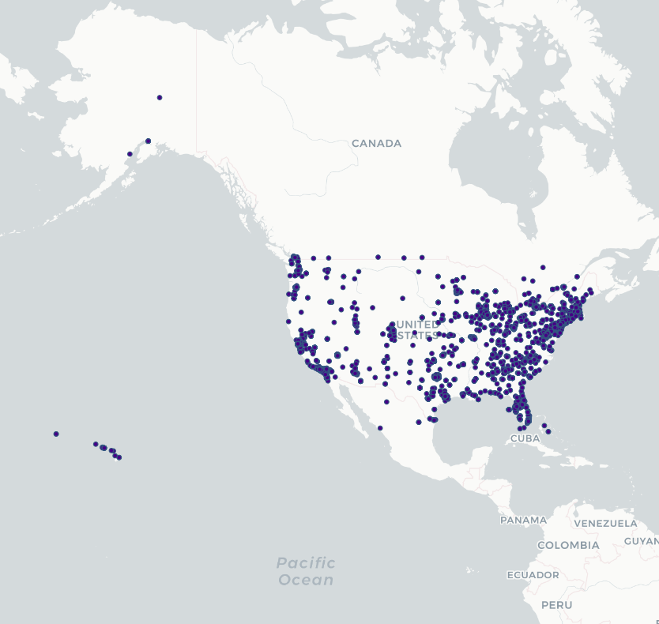
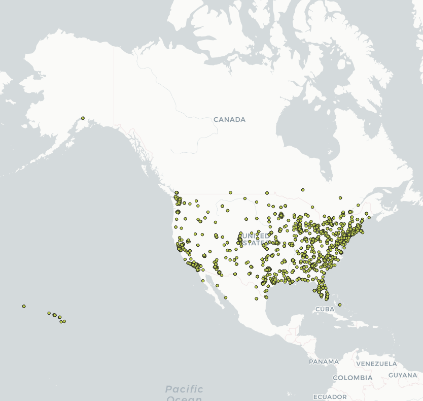
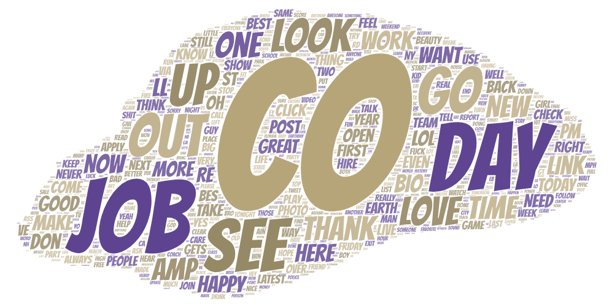
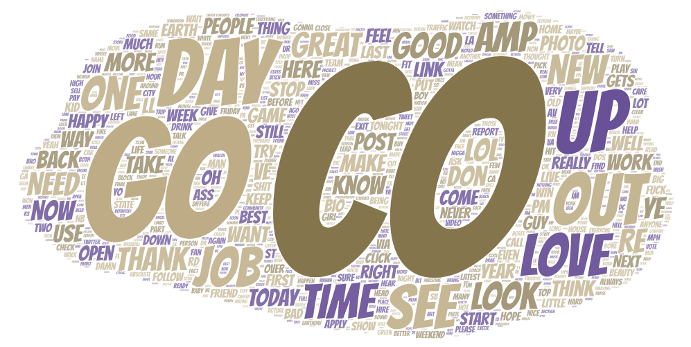

# GEOG 458 Lab 2: Geo-tagged tweet collection and visualization

## Introduction

I used the provided tweet harvester to look at tweets gathered two hours apart in the United States. I first harvested tweets at around 1pm PST (4pm EST) and then again at around 3pm PST (6pm EST). This was done to see how different tweets with be within a small span of just two hours. Before choosing to do this I believed that were would be a larger amount of tweets on the East Coast as the initial time of 4pm EST would be when people would still be at work (Assuming a 9 to 5 work day) and the time of 6pm EST would about an hour after people are off work under the same assumption.

## Map Comparison

  
   

As shown in the images above, my assumption that more tweets would originate from the East Coast seems to be correct however there is no clear explanation why this is. I believe this is due to people leaving or about to leave work like I mentioned earlier. It also looks like there was an inreased concentration of tweets in the Seattle area, possibly due to the President's Visit and him signing a new executive order.

## Word Cloud Comparison

  
   

The word that showed up most often during both times was "CO" which I believe is due to twitter links starting with "t.co". The next biggest words during the first time of 4pm EST are "Job" and "Day" possibly from people talking about their Job or day while at work. In the 6pm EST set of tweets the usage of "Job" reduces again possibly due to people being away from work. There were a lot of words that were shared between both sets of time with "Go", "Out", "New", "Look", "Up", "Love" and "Thank" being some of the most prominent.
